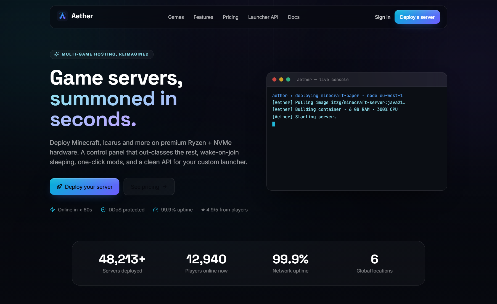
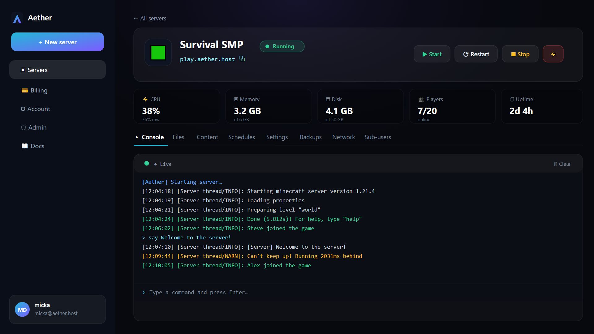
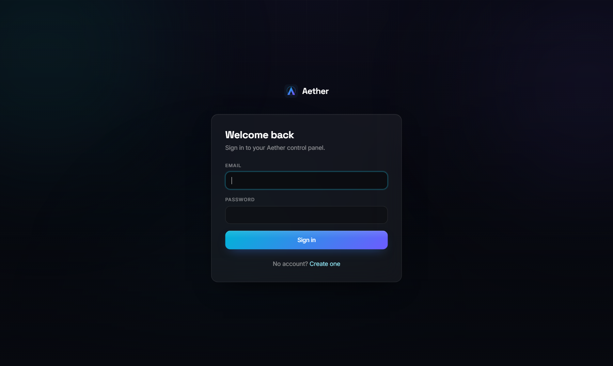
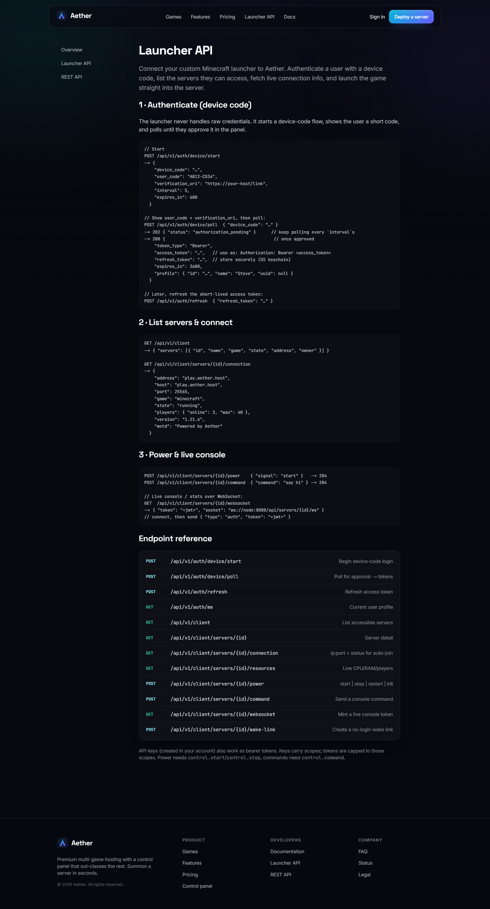
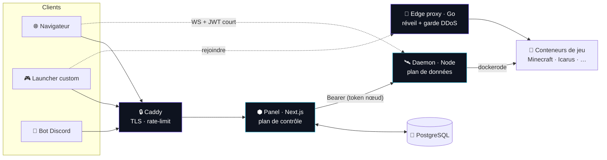

<div align="center">


# Aether

### Des serveurs de jeu, invoqués en quelques secondes.

**Hébergement multi-jeux premium et auto-hébergeable** — Minecraft, Icarus & plus —
avec un panneau de contrôle glassmorphism/bento splendide, le réveil-à-la-connexion,
l'installation de mods en un clic, une protection DDoS multi-couches, et une API
pensée pour **votre propre launcher**.

[English](README.md) · **🌐 Français**

<br/>

[](https://github.com/Micka420-collab/Aether_Panel/actions/workflows/ci.yml)
[](LICENSE)


<br/>


<br/>


<br/>

[**Fonctionnalités**](#-fonctionnalités) · [**Architecture**](#️-architecture) · [**Démarrage**](#-démarrage-rapide) · [**API launcher**](#-connecter-votre-launcher) · [**Anti-DDoS**](#️-protection-ddos-multi-couches) · [**Sécurité**](#-sécurité)

</div>

---

## 📸 Captures d'écran

<div align="center">



<br/><br/>

> **Tableau de bord** — console live, stats temps réel, fichiers, mods, tâches planifiées…
> <br/><sub>(aperçu fidèle au design ; le dashboard nécessite une base + un nœud actifs)</sub>



<br/><br/>

<table>
<tr>
<td width="50%"><p align="center"><sub>Connexion (2FA TOTP prête)</sub></p></td>
<td width="50%"><p align="center"><sub>Documentation de l'API launcher</sub></p></td>
</tr>
</table>

</div>

---

## Pourquoi Aether ?

Conçu pour surpasser Pterodactyl, Aternos, Shockbyte & GPORTAL sur **trois axes à la fois** :

| 🎛️ Expérience | 🧩 Étendue | 🛡️ Confiance |
|---------------|-----------|--------------|
| Déploiement en un clic, console & télémétrie live, sommeil réveil-à-la-connexion, un dashboard qui ne date pas de 2014. | Un moteur de *templates (eggs)* générique — Minecraft & Icarus aujourd'hui, n'importe quel jeu en **données, pas en code**. | TPS/RAM/CPU live, isolation durcie des conteneurs, protection DDoS multi-couches, sommeil équitable (pas de quota journalier). |

---

## ✨ Fonctionnalités

| | |
|---|---|
| 🟩 **Multi-jeux** | Minecraft (Java + Bedrock : Paper, Purpur, Fabric, Forge, NeoForge, Vanilla, modpacks) · Icarus · Valheim · Palworld · Rust |
| 🖥️ **Console live** | Console temps réel (type xterm) via WebSocket, saisie de commandes, contrôles d'alimentation |
| 📊 **Télémétrie** | CPU / RAM / disque / réseau / joueurs, en direct, dans un dashboard bento |
| 🌙 **Réveil-à-la-connexion** | Les serveurs dorment quand ils sont vides et se réveillent à la 1ère connexion — + un lien de réveil partageable sans login |
| 📦 **Contenu en 1 clic** | Recherche & installation de mods/plugins/modpacks depuis **Modrinth** *et* **CurseForge** |
| 📁 **Fichiers + SFTP** | Éditeur dans le navigateur & serveur SFTP confiné (mot de passe du compte) |
| 💾 **Sauvegardes** | À la demande & planifiées, monde « flushé », restauration en un clic |
| 🌐 **Sous-domaines gratuits** | Réservez `vous.exemple.com` — enregistrements **A + SRV** auto (Cloudflare) |
| ⏰ **Tâches planifiées** | Redémarrages / commandes / sauvegardes en cron via un scheduler intégré |
| 👥 **Sous-utilisateurs** | Accès d'équipe granulaire et scoped à un serveur |
| 💳 **Facturation à crédits** | Mesure au Go-heure, jamais facturé à l'arrêt |
| 🔌 **API launcher** | Auth device-code + API REST/WS versionnée pour votre launcher custom |
| 🤖 **Bot Discord** | `/status` `/start` `/stop` `/console` depuis Discord |
| 🚨 **Monitoring** | Santé des nœuds & détection de crash, auto-restart, alertes webhook Discord |
| 🛡️ **Protection DDoS** | Multi-couches : rate-limit panel + garde edge conscient de Minecraft + nftables |
| 🔐 **Sécurité du compte** | 2FA TOTP, clés API scoped & hashées, verrouillage anti brute-force, journal d'audit |

---

## 🏗️ Architecture

Un **plan de contrôle** sans état (panel) + un **plan de données** par nœud (daemon) —
le découpage éprouvé Panel ↔ Wings, reconstruit en monorepo TypeScript/Go moderne.



- **`packages/shared`** — types sans dépendances, scopes de permission, et le **moteur de templates de jeux**.
- **`apps/panel`** — Next.js (App Router) : site vitrine + dashboard + REST + API launcher `/api/v1` + scheduler cron + monitor. Prisma/PostgreSQL.
- **`apps/daemon`** — pilote Docker via `dockerode` : cycle de vie, WebSocket console/stats, RCON, gestionnaire de fichiers confiné, SFTP, sauvegardes tar.gz.
- **`apps/edge-proxy`** — proxy Go de réveil-à-la-connexion avec un garde anti-DDoS conscient de Minecraft.

---

## 🚀 Démarrage rapide

**Ubuntu + Docker — une seule commande :**

```bash
git clone https://github.com/Micka420-collab/Aether_Panel.git aether && cd aether
sudo bash deploy/install.sh           # ajoutez APPLY_FIREWALL=1 pour durcir l'hôte aussi
```

L'installeur met en place Docker, génère des secrets forts, construit les images
et démarre **panel + daemon + Postgres + Caddy + edge-proxy**. Ouvrez l'URL affichée
et inscrivez-vous — le **premier compte devient administrateur**.

> 💡 Définissez `APP_DOMAIN=panel.example.com` avant pour le HTTPS automatique.

<details>
<summary><b>Développement local</b></summary>

```bash
npm install
npm run build:shared
cp .env.example .env                            # puis éditez les secrets
cp apps/panel/.env.example apps/panel/.env
# démarrez Postgres, puis :
npm run db:push  --workspace @aether/panel
npm run db:seed  --workspace @aether/panel
npm run dev                                     # panel :3000 + daemon :8080
npm test                                        # vitest (moteur de templates + jail des chemins)
```

Le daemon a besoin d'un moteur Docker accessible (`/var/run/docker.sock`).
</details>

---

## 🎮 Ajouter un jeu

Un jeu, ce sont **juste des données**. Écrivez un objet `GameTemplate` dans
`packages/shared/src/templates/` et enregistrez-le — il déclare la/les image(s)
Docker, le comportement de démarrage/arrêt, les ports, les variables d'env
(rendues automatiquement en formulaire de réglages), le script d'installation et
les capacités (`rcon`, `wine`, `steamcmd`, `mods`, …). Aucune modif du daemon ni du panel.

> Voir `minecraft.ts` (RCON) et `icarus.ts` (SteamCMD sous Wine) pour des exemples.

---

## 🔌 Connecter votre launcher

`/api/v1` expose un flux **device-code** adapté au desktop + des infos de connexion live :

```ts
// 1 · authentification (aucun secret embarqué)
const { user_code, device_code } = await api.post("/api/v1/auth/device/start");
showToUser(user_code);                          // "AB12-CD34" → l'utilisateur valide sur /link
const { access_token } = await api.poll("/api/v1/auth/device/poll", { device_code });

// 2 · lister ses serveurs, récupérer l'adresse de connexion
const { servers } = await api.get("/api/v1/client", { bearer: access_token });
const conn = await api.get(`/api/v1/client/servers/${servers[0].id}/connection`);

// 3 · lancer directement dans le serveur
minecraft.launch({ server: conn.host, port: conn.port });
```

Un client de référence exécutable et sans dépendance se trouve dans
[`examples/launcher`](examples/launcher) · guide complet dans `/docs/launcher`.

---

## 🛡️ Protection DDoS (multi-couches)

Défense en profondeur — aucune couche n'est utilisée seule :

| Couche | Où | Ce qu'elle fait |
|--------|----|-----------------|
| **L7 — panel/API** | `apps/panel/src/middleware.ts` | Rate-limit par IP (strict sur l'auth), `429` + `Retry-After`, en-têtes de sécurité |
| **Conscient de Minecraft** | garde `apps/edge-proxy` | Plafond de connexions/IP + débit, anti ping-flood, timeout slow-loris, ban auto des floods de paquets, blocklist, IP réelle via PROXY protocol |
| **L4 — hôte** | `deploy/firewall.sh` (nftables) | Drop conntrack-INVALID, anti SYN-flood par source, anti-amplification UDP, limites ICMP/SSH, **Mode Attaque** |
| **Edge / TLS** | Caddy | HTTPS auto, HSTS, en-têtes de sécurité, HTTP/2-3 |
| **Amont (optionnel)** | fournisseur | Frontez le trafic de jeu avec un scrubber (Cloudflare Spectrum / TCPShield) ; le PROXY protocol préserve les IP réelles |

```bash
sudo SSH_PORT=22 bash deploy/firewall.sh apply   # ou 'attack' en cas d'attaque active
```

---

## 🔐 Sécurité

Durci par conception et **audité de façon adversariale** — voir
[`docs/SECURITY-AUDIT.md`](docs/SECURITY-AUDIT.md) et [`SECURITY.md`](SECURITY.md).

- bcrypt + **2FA TOTP** (secrets chiffrés AES-256-GCM, codes de récupération HMAC à usage unique)
- Secrets **fail-closed** en production · comparaisons de tokens en temps constant
- Clés **API** scoped et hashées · tokens WebSocket HMAC à courte durée
- Gestionnaire de fichiers & SFTP confinés (anti-symlink) · scopes de permission par serveur
- **Verrouillage anti brute-force** par compte · IP cliente fiable (anti-spoofing)
- Limites CPU/RAM/PID par conteneur + drop de capacités · RCON lié à la loopback

---

## 🧰 Stack technique

| Domaine | Technos |
|---------|---------|
| **Panel** | Next.js (App Router), React, TypeScript, Tailwind CSS, Framer Motion, Prisma, PostgreSQL |
| **Daemon** | Node.js, Express, `dockerode`, `ws`, RCON, `ssh2` (SFTP) |
| **Edge proxy** | Go (protocole Minecraft, réveil-à-la-connexion, garde DDoS) |
| **Auth** | Sessions en base, `jose` (JWT/HMAC), `otplib` (TOTP), `bcryptjs` |
| **Infra** | Docker Compose, Caddy (TLS auto), nftables, CI GitHub Actions, Vitest |

---

## 📂 Arborescence

```
packages/shared      types, scopes, moteur de templates de jeux  (+ vitest)
apps/panel           panel Next.js — UI + REST + API launcher + scheduler + monitor
apps/daemon          daemon de contrôle Docker + serveur SFTP  (+ vitest)
apps/edge-proxy      proxy Go réveil-à-la-connexion + garde anti-DDoS
apps/discord-bot     bot Discord de contrôle (commandes slash)
examples/launcher    client launcher de référence sans dépendance
deploy/              install.sh · Caddyfile · firewall.sh · unité systemd
docker-compose.yml   stack mono-hôte
.github/workflows    CI : build · typecheck · tests · go build
```

---

## 🗺️ Feuille de route

Suivie dans [`docs/SECURITY-AUDIT.md`](docs/SECURITY-AUDIT.md) :
facturation Stripe · login OAuth Microsoft/Discord · import d'eggs Pterodactyl ·
ordonnancement multi-nœuds · rate-limit via Redis · montée de version majeure Next.js.

---

<div align="center">

**Sous licence MIT** · Conçu avec ⟁ pour les auto-hébergeurs.

</div>
