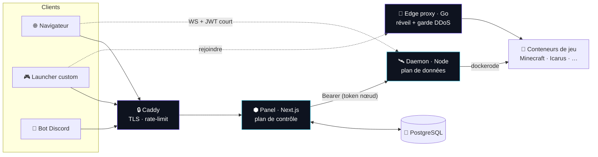

<div align="center">


# Aether

### Des serveurs de jeu, invoqués en quelques secondes.

**Hébergez vous-même votre plateforme de serveurs de jeu — une qui a enfin l'air, et le feeling, premium.**

Lancez Minecraft, Icarus, Valheim, Palworld ou Rust en quelques secondes, puis pilotez-les
depuis un panneau de contrôle épuré, tout en verre et bento. Un **copilote IA** répond à vos
questions et corrige les problèmes à votre place, les serveurs **s'endorment quand personne ne
joue** et se réveillent dès qu'un joueur se connecte, et les mods, modpacks, sauvegardes — voire
le clonage complet d'un serveur — se font en un clic. Une **API propre** vous laisse brancher
votre propre launcher, la protection DDoS multi-couches est intégrée — et tout tourne sur *votre*
matériel, selon vos règles, sans abonnement par siège.

[English](README.md) · **🌐 Français**

<br/>

[](https://github.com/Micka420-collab/Aether_Panel/actions/workflows/ci.yml)
[](LICENSE)


<br/>


<br/>


<br/>

### Une commande. Votre propre plateforme d'hébergement de jeux.

```bash
curl -fsSL https://raw.githubusercontent.com/Micka420-collab/Aether_Panel/main/deploy/get.sh | sudo bash
```

<br/>

[**Démarrage**](#-démarrage-rapide) · [**Fonctionnalités**](#-fonctionnalités) · [**Nouveautés**](#-nouveautés) · [**Architecture**](#️-architecture) · [**API launcher**](#-connecter-votre-launcher) · [**Anti-DDoS**](#️-protection-ddos-multi-couches) · [**Sécurité**](#-sécurité)

</div>

---

## 🚀 Démarrage rapide

**Ubuntu + Docker — littéralement une ligne :**

```bash
curl -fsSL https://raw.githubusercontent.com/Micka420-collab/Aether_Panel/main/deploy/get.sh | sudo bash
```

C'est tout. Le bootstrap clone le dépôt dans `/opt/aether`, installe Docker, génère
des secrets forts, construit les images et démarre toute la stack —
**panel + daemon + Postgres + Caddy + edge-proxy**. À la fin il affiche l'URL de votre
panel ; ouvrez-la et inscrivez-vous — le **premier compte devient administrateur**. ✨

```bash
# Vous voulez le HTTPS + un domaine, ou durcir aussi le pare-feu de l'hôte ? Ajoutez des env :
curl -fsSL .../deploy/get.sh | sudo APP_DOMAIN=panel.example.com APPLY_FIREWALL=1 bash
```

<details>
<summary><b>Vous préférez cloner d'abord ? (même résultat)</b></summary>

```bash
git clone https://github.com/Micka420-collab/Aether_Panel.git aether && cd aether
sudo bash deploy/install.sh        # ajoutez APPLY_FIREWALL=1 pour durcir l'hôte aussi
```

</details>

<details>
<summary><b>Au quotidien avec <code>make</code></b></summary>

Un `Makefile` convivial enrobe Docker Compose pour ne jamais retenir les options :

```bash
make install     # installer / déployer
make up          # démarrer la stack
make logs        # suivre panel + daemon
make ps          # statut
make update      # git pull + rebuild + restart
make backup-db   # dump Postgres gzip dans /var/lib/aether/backups
make down        # arrêter
make help        # tout lister (par défaut)
```

</details>

<details>
<summary><b>Développement local</b></summary>

```bash
npm install
npm run build:shared
cp .env.example .env                            # puis éditez les secrets
cp apps/panel/.env.example apps/panel/.env
# démarrez Postgres, puis :
npm run db:push  --workspace @aether/panel
npm run db:seed  --workspace @aether/panel
npm run dev                                     # panel :3000 + daemon :8080
npm test                                        # vitest (moteur de templates + jail des chemins)
```

Le daemon a besoin d'un moteur Docker accessible (`/var/run/docker.sock`).
</details>

---

## 📸 Le panel

<div align="center">


<br/><sub>Console live, télémétrie temps réel, fichiers, mods, tâches, sauvegardes & plus — dans un dashboard qui ne date pas de 2014.</sub>

</div>

---

## ✨ Nouveautés

> Une vague de fonctionnalités phares — chacune marche directement, sans config en plus.

<div align="center">

<table>
<tr>
<td width="50%" valign="top">
<br/>
<b>✦ Copilote IA</b><br/>
<sub>Demandez « pourquoi mon serveur ne démarre pas ? » et obtenez une vraie réponse — avec des correctifs en un clic. Collez votre clé Anthropic directement dans le dashboard (sans code), ou utilisez l'assistant à base de règles hors-ligne.</sub>
</td>
<td width="50%" valign="top">
<br/>
<b>🩺 Mod Doctor</b><br/>
<sub>Scanne vos mods/plugins : doublons, mods client-only, incompatibilités loader/version & dépendances manquantes — et met les fautifs en quarantaine, de façon réversible.</sub>
</td>
</tr>
<tr>
<td width="50%" valign="top">
<br/>
<b>🧩 Marketplace de Blueprints</b><br/>
<sub>Publiez un serveur parfaitement configuré comme blueprint partageable — et déployez n'importe quel blueprint dans un nouveau serveur en un clic.</sub>
</td>
<td width="50%" valign="top">
<br/>
<b>📈 Historique des métriques</b><br/>
<sub>CPU / RAM / joueurs échantillonnés dans le temps et tracés en graphes nets dans l'app — 1h / 24h / 7j.</sub>
</td>
</tr>
</table>

</div>

Et aussi : **🧬 Cloner & brancher** un serveur (config + monde, depuis une sauvegarde) ·
**🔀 Réseaux Velocity** (gérez la liste des serveurs backend depuis le panel) ·
**🎮 Crossplay** (Bedrock ↔ Java via Geyser/Floodgate) ·
**🌍 Carte du monde** (rendu & téléchargement) · **☁️ Sauvegardes S3 off-site** ·
**💳 Top-up carte Stripe** · **🔑 Changer son mot de passe** & **upgrade de plan** en un clic.

---

## Pourquoi Aether ?

Conçu pour surpasser Pterodactyl, Aternos, Shockbyte & GPORTAL sur **trois axes à la fois** :

| 🎛️ Expérience | 🧩 Étendue | 🛡️ Confiance |
|---------------|-----------|--------------|
| Install en une ligne, déploiement en un clic, un **copilote IA**, console & télémétrie live, sommeil réveil-à-la-connexion, un dashboard glass/bento. | Un moteur de *templates (eggs)* générique — Minecraft, Icarus, Valheim, Palworld, Rust & Velocity aujourd'hui ; n'importe quel jeu en **données, pas en code**. | TPS/RAM/CPU live, isolation durcie des conteneurs, protection DDoS multi-couches, sommeil équitable (pas de quota journalier), audité de façon adversariale. |

---

## ✨ Fonctionnalités

| | |
|---|---|
| 🟩 **Multi-jeux** | Minecraft (Java + Bedrock : Paper, Purpur, Fabric, Forge, NeoForge, Vanilla, modpacks) · Icarus · Valheim · Palworld · Rust · proxy **Velocity** |
| ✦ **Copilote IA** | Un assistant chat par serveur qui explique les erreurs et propose des correctifs en un clic — **connectez votre clé Anthropic depuis le dashboard** (Admin), ou en mode règles hors-ligne |
| 🖥️ **Console live** | Console temps réel (type xterm) via WebSocket, saisie de commandes, contrôles d'alimentation |
| 📊 **Télémétrie + historique** | CPU / RAM / disque / réseau / joueurs, en direct **et** tracés dans le temps (1h/24h/7j) |
| 🌙 **Réveil-à-la-connexion** | Les serveurs dorment quand ils sont vides et se réveillent à la 1ère connexion — + un lien de réveil partageable sans login |
| 📦 **Contenu en 1 clic** | Recherche & installation de mods/plugins/**modpacks** depuis **Modrinth** *et* **CurseForge** |
| 🩺 **Mod Doctor** | Détecte conflits/doublons/incompatibilités de mods et les met en quarantaine de façon réversible |
| 🧬 **Cloner & brancher** | Dupliquez la config d'un serveur — et au choix son monde, depuis n'importe quelle sauvegarde |
| 🧩 **Blueprints** | Publiez une config une fois, déployez-la partout en un clic — une marketplace de serveurs |
| 🔀 **Réseaux Velocity** | Lancez un proxy et gérez sa liste de serveurs backend depuis le panel |
| 🎮 **Crossplay** | Joueurs Bedrock sur un serveur Java via Geyser/Floodgate, activable depuis l'UI |
| 🌍 **Carte du monde** | Rendu & téléchargement d'une carte d'aperçu de votre monde Minecraft |
| 📁 **Fichiers + SFTP** | Éditeur dans le navigateur & serveur SFTP confiné (mot de passe du compte) |
| 💾 **Sauvegardes** | À la demande & planifiées, monde « flushé », restauration en un clic — **+ S3 off-site** |
| 🌐 **Sous-domaines gratuits** | Réservez `vous.exemple.com` — enregistrements **A + SRV** auto (Cloudflare), ou **DuckDNS** |
| ⏰ **Tâches planifiées** | Redémarrages / commandes / sauvegardes en cron via un scheduler intégré |
| 👥 **Sous-utilisateurs** | Accès d'équipe granulaire et scoped à un serveur |
| 💳 **Facturation à crédits** | Mesure au Go-heure, jamais facturé à l'arrêt — top-up carte **Stripe** |
| 🔌 **API launcher** | Auth device-code + API REST/WS versionnée pour votre launcher custom |
| 🤖 **Bot Discord** | `/status` `/start` `/stop` `/console` depuis Discord |
| 🚨 **Monitoring** | Santé des nœuds & détection de crash, auto-restart, alertes webhook Discord |
| 🛡️ **Protection DDoS** | Multi-couches : rate-limit panel + garde edge conscient de Minecraft + nftables |
| 🔐 **Sécurité du compte** | 2FA TOTP, **changement de mot de passe en self-service**, clés API scoped & hashées, verrouillage anti brute-force, journal d'audit |

---

## 🏗️ Architecture

Un **plan de contrôle** sans état (panel) + un **plan de données** par nœud (daemon) —
le découpage éprouvé Panel ↔ Wings, reconstruit en monorepo TypeScript/Go moderne.



- **`packages/shared`** — types sans dépendances, scopes de permission, et le **moteur de templates de jeux**.
- **`apps/panel`** — Next.js (App Router) : site vitrine + dashboard + REST + API launcher `/api/v1` + scheduler cron + monitor + copilote IA. Prisma/PostgreSQL.
- **`apps/daemon`** — pilote Docker via `dockerode` : cycle de vie, WebSocket console/stats, RCON, gestionnaire de fichiers confiné, SFTP, sauvegardes tar.gz, copies S3 off-site sans dépendance.
- **`apps/edge-proxy`** — proxy Go de réveil-à-la-connexion avec un garde anti-DDoS conscient de Minecraft.
- **`apps/discord-bot`** — bot Discord de contrôle (commandes slash), opt-in.

---

## 🎮 Ajouter un jeu

Un jeu, ce sont **juste des données**. Écrivez un objet `GameTemplate` dans
`packages/shared/src/templates/` et enregistrez-le — il déclare la/les image(s)
Docker, le comportement de démarrage/arrêt, les ports, les variables d'env
(rendues automatiquement en formulaire de réglages), le script d'installation et
les capacités (`rcon`, `wine`, `steamcmd`, `mods`, …). Aucune modif du daemon ni du panel.

> Voir `minecraft.ts` (RCON), `icarus.ts` (SteamCMD sous Wine) et `velocity.ts` (proxy) pour des exemples.

---

## 🔌 Connecter votre launcher

`/api/v1` expose un flux **device-code** adapté au desktop + des infos de connexion live :

```ts
// 1 · authentification (aucun secret embarqué)
const { user_code, device_code } = await api.post("/api/v1/auth/device/start");
showToUser(user_code);                          // "AB12-CD34" → l'utilisateur valide sur /link
const { access_token } = await api.poll("/api/v1/auth/device/poll", { device_code });

// 2 · lister ses serveurs, récupérer l'adresse de connexion
const { servers } = await api.get("/api/v1/client", { bearer: access_token });
const conn = await api.get(`/api/v1/client/servers/${servers[0].id}/connection`);

// 3 · lancer directement dans le serveur
minecraft.launch({ server: conn.host, port: conn.port });
```

Un client de référence exécutable et sans dépendance se trouve dans
[`examples/launcher`](examples/launcher) · guide complet dans `/docs/launcher` ·
spec lisible par machine sur `/api/openapi.json`.

---

## 🛡️ Protection DDoS (multi-couches)

Défense en profondeur — aucune couche n'est utilisée seule :

| Couche | Où | Ce qu'elle fait |
|--------|----|-----------------|
| **L7 — panel/API** | `apps/panel/src/middleware.ts` | Rate-limit par IP (strict sur l'auth), `429` + `Retry-After`, en-têtes de sécurité |
| **Conscient de Minecraft** | garde `apps/edge-proxy` | Plafond de connexions/IP + débit, anti ping-flood, timeout slow-loris, ban auto des floods de paquets, blocklist, IP réelle via PROXY protocol |
| **L4 — hôte** | `deploy/firewall.sh` (nftables) | Drop conntrack-INVALID, anti SYN-flood par source, anti-amplification UDP, limites ICMP/SSH, **Mode Attaque** |
| **Edge / TLS** | Caddy | HTTPS auto, HSTS, en-têtes de sécurité, HTTP/2-3 |
| **Amont (optionnel)** | fournisseur | Frontez le trafic de jeu avec un scrubber (Cloudflare Spectrum / TCPShield) ; le PROXY protocol préserve les IP réelles |

```bash
sudo SSH_PORT=22 bash deploy/firewall.sh apply   # ou 'attack' en cas d'attaque active
```

---

## 🔐 Sécurité

Durci par conception et **audité de façon adversariale** — voir
[`docs/SECURITY-AUDIT.md`](docs/SECURITY-AUDIT.md) et [`SECURITY.md`](SECURITY.md).

- bcrypt + **2FA TOTP** (secrets chiffrés AES-256-GCM, codes de récupération HMAC à usage unique)
- **Changement de mot de passe en self-service** — vérifie le mot de passe actuel, puis révoque toutes les autres sessions
- Secrets **fail-closed** en production · comparaisons de tokens en temps constant
- Clés **API** scoped et hashées · tokens WebSocket HMAC à courte durée
- Gestionnaire de fichiers & SFTP confinés (anti-symlink) · scopes de permission par serveur
- **Verrouillage anti brute-force** par compte (login, 2FA *et* changement de mot de passe) · IP cliente fiable (anti-spoofing)
- Limites CPU/RAM/PID par conteneur + drop de capacités · RCON lié à la loopback

---

## 🧰 Stack technique

| Domaine | Technos |
|---------|---------|
| **Panel** | Next.js (App Router), React, TypeScript, Tailwind CSS, Framer Motion, Prisma, PostgreSQL |
| **Daemon** | Node.js, Express, `dockerode`, `ws`, RCON, `ssh2` (SFTP), S3 SigV4 sans dépendance |
| **Edge proxy** | Go (protocole Minecraft, réveil-à-la-connexion, garde DDoS) |
| **Auth** | Sessions en base, `jose` (JWT/HMAC), `otplib` (TOTP), `bcryptjs` |
| **Infra** | Docker Compose, Caddy (TLS auto), nftables, CI GitHub Actions, Vitest |

---

## 📂 Arborescence

```
packages/shared      types, scopes, moteur de templates de jeux  (+ vitest)
apps/panel           panel Next.js — UI + REST + API launcher + scheduler + monitor + copilote
apps/daemon          daemon de contrôle Docker + serveur SFTP + sauvegardes S3  (+ vitest)
apps/edge-proxy      proxy Go réveil-à-la-connexion + garde anti-DDoS
apps/discord-bot     bot Discord de contrôle (commandes slash)
examples/launcher    client launcher de référence sans dépendance
deploy/              get.sh (one-liner) · install.sh · Caddyfile · firewall.sh · unité systemd
Makefile             wrappers `make` conviviaux autour de docker compose
docker-compose.yml   stack mono-hôte
.github/workflows    CI : build · typecheck · tests · go build
```

---

## 🗺️ Feuille de route

Livré récemment : copilote IA · clonage/branche de serveur · réseaux Velocity · Mod Doctor ·
marketplace de blueprints · historique des métriques · top-up Stripe · sauvegardes S3 off-site · crossplay.
Ensuite : login OAuth Microsoft/Discord · import d'eggs Pterodactyl · ordonnancement multi-nœuds ·
rate-limit via Redis.

---

<div align="center">

### Conçu par

**Micka Delcato** &nbsp;✕&nbsp; **Nextendo**

<sub>**Sous licence MIT** · Conçu avec ⟁ pour les auto-hébergeurs.</sub>

</div>
