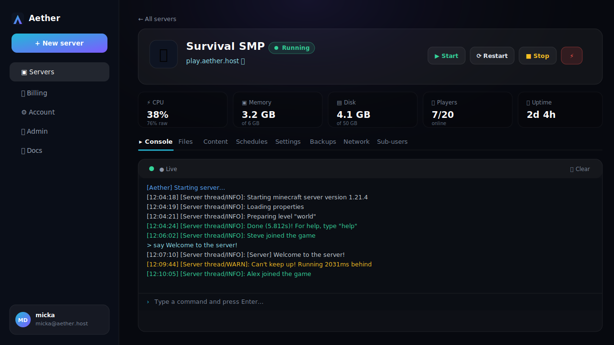
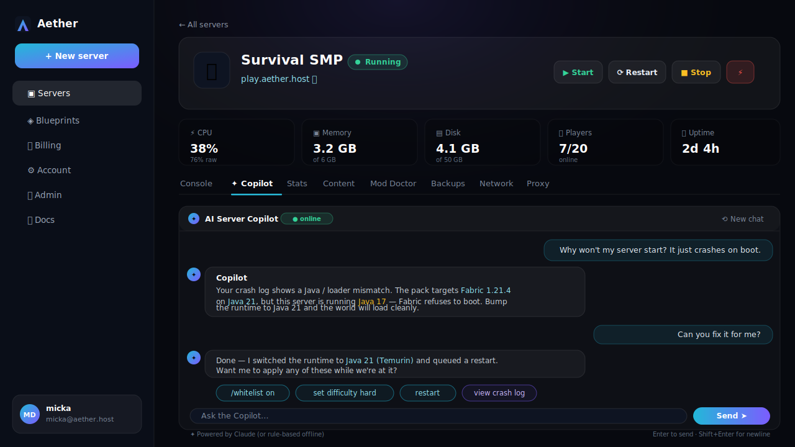
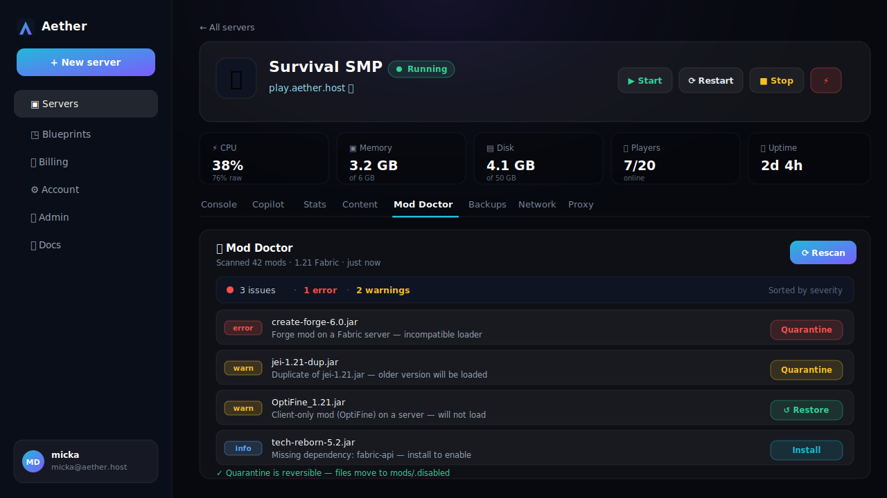
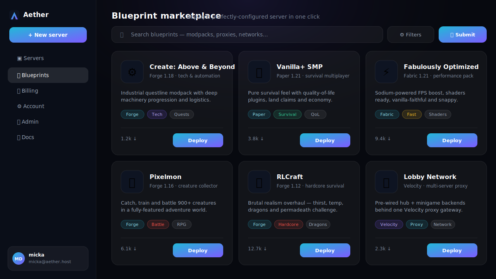
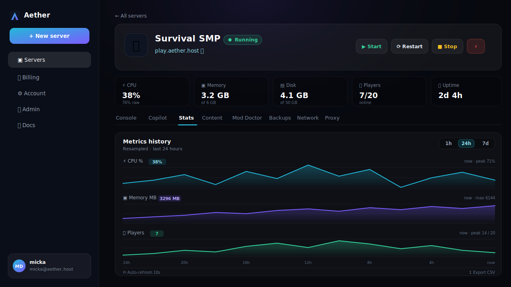
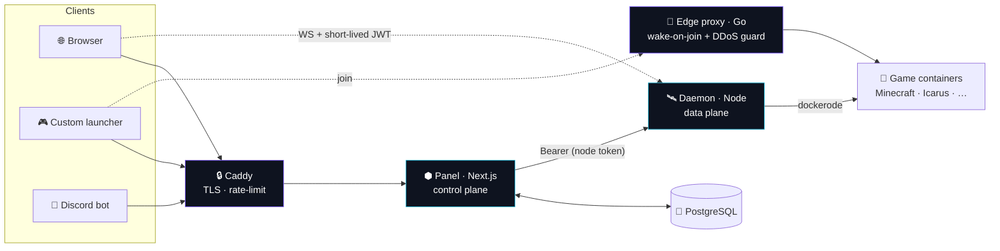

<div align="center">


# Aether

### Game servers, summoned in seconds.

**The self-hostable game-hosting panel that finally looks — and feels — premium.**
Minecraft, Icarus, Valheim, Palworld, Rust & more, behind a glass/bento control
panel with an **AI copilot**, wake-on-join sleeping, one-click modpacks, server
**cloning**, a **blueprint marketplace**, layered DDoS protection, and a clean
API built for your **own launcher**.

**🌐 English** · [Français](README.fr.md)

<br/>

[](https://github.com/Micka420-collab/Aether_Panel/actions/workflows/ci.yml)
[](LICENSE)


<br/>


<br/>



<br/>

### One command. Your own game-hosting platform.

```bash
curl -fsSL https://raw.githubusercontent.com/Micka420-collab/Aether_Panel/main/deploy/get.sh | sudo bash
```

<br/>

[**Quick start**](#-quick-start) · [**Features**](#-features) · [**Whats new**](#-whats-new) · [**Architecture**](#-architecture) · [**Launcher API**](#-connect-your-launcher) · [**DDoS protection**](#-ddos-protection-layered) · [**Security**](#-security)

</div>

---

## 🚀 Quick start

**Ubuntu + Docker — literally one line:**

```bash
curl -fsSL https://raw.githubusercontent.com/Micka420-collab/Aether_Panel/main/deploy/get.sh | sudo bash
```

That's it. The bootstrap clones the repo to `/opt/aether`, installs Docker, generates
strong secrets, builds the images and brings up the whole stack —
**panel + daemon + Postgres + Caddy + edge-proxy**. When it finishes it prints your
panel URL; open it and register — the **first account becomes the admin**. ✨

```bash
# Want HTTPS + a domain, or to also harden the host firewall? Just add env:
curl -fsSL .../deploy/get.sh | sudo APP_DOMAIN=panel.example.com APPLY_FIREWALL=1 bash
```

<details>
<summary><b>Prefer to clone first? (same result)</b></summary>

```bash
git clone https://github.com/Micka420-collab/Aether_Panel.git aether && cd aether
sudo bash deploy/install.sh        # add APPLY_FIREWALL=1 to harden the host too
```

</details>

<details>
<summary><b>Day-to-day with <code>make</code></b></summary>

A friendly `Makefile` wraps Docker Compose so you never memorise flags:

```bash
make install     # install / deploy
make up          # start the stack
make logs        # tail panel + daemon
make ps          # status
make update      # git pull + rebuild + restart
make backup-db   # gzip a Postgres dump to /var/lib/aether/backups
make down        # stop
make help        # list everything (default)
```

</details>

<details>
<summary><b>Local development</b></summary>

```bash
npm install
npm run build:shared
cp .env.example .env                            # then edit the secrets
cp apps/panel/.env.example apps/panel/.env
# start Postgres, then:
npm run db:push  --workspace @aether/panel
npm run db:seed  --workspace @aether/panel
npm run dev                                     # panel :3000 + daemon :8080
npm test                                        # vitest (template engine + path jail)
```

The daemon needs a reachable Docker engine (`/var/run/docker.sock`).
</details>

---

## 📸 The panel

<div align="center">



<br/><sub>Live console, real-time telemetry, files, mods, schedules, backups & more — in a dashboard that doesn't look like 2014.</sub>

</div>

---

## ✨ What's new

> A wave of flagship features — each one works out of the box, no extra config.

<div align="center">

<table>
<tr>
<td width="50%" valign="top">
<br/>
<b>✦ AI Server Copilot</b><br/>
<sub>Ask "why won't my server start?" and get a real answer — with one-click fixes. Uses your Anthropic key, or a built-in rule-based helper offline.</sub>
</td>
<td width="50%" valign="top">
<br/>
<b>🩺 Mod Conflict Doctor</b><br/>
<sub>Scans your mods/plugins for duplicates, client-only mods, loader/version mismatches & missing deps — and quarantines the bad ones, reversibly.</sub>
</td>
</tr>
<tr>
<td width="50%" valign="top">
<br/>
<b>🧩 Blueprint Marketplace</b><br/>
<sub>Publish a perfectly-configured server as a shareable blueprint — and deploy any blueprint into a brand-new server in one click.</sub>
</td>
<td width="50%" valign="top">
<br/>
<b>📈 Metrics history</b><br/>
<sub>Per-server CPU / RAM / players sampled over time and drawn as crisp in-app charts — 1h / 24h / 7d.</sub>
</td>
</tr>
</table>

</div>

Plus: **🧬 Clone & branch** a server (config + world, straight from a backup) ·
**🔀 Velocity proxy networks** (manage your backend server list from the panel) ·
**🎮 Crossplay** (Bedrock ↔ Java via Geyser/Floodgate) ·
**🌍 World map** render & download · **☁️ Off-site S3 backups** ·
**💳 Stripe card top-ups** · **🔑 Change your password** & one-click **plan upgrades**.

---

## Why Aether?

Built to out-class Pterodactyl, Aternos, Shockbyte & GPORTAL on **three axes at once**:

| 🎛️ UX | 🧩 Breadth | 🛡️ Trust |
|-------|-----------|----------|
| One-line install, one-click deploy, an **AI copilot**, live console & telemetry, wake-on-join sleeping, a glass/bento dashboard. | A generic *template (egg)* engine — Minecraft, Icarus, Valheim, Palworld, Rust & Velocity today; any game as **data, not code**. | Live TPS/RAM/CPU, hardened container isolation, layered DDoS protection, fair sleeping (no daily caps), adversarially audited. |

---

## ✨ Features

| | |
|---|---|
| 🟩 **Multi-game** | Minecraft (Java + Bedrock: Paper, Purpur, Fabric, Forge, NeoForge, Vanilla, modpacks) · Icarus · Valheim · Palworld · Rust · **Velocity** proxy |
| ✦ **AI Copilot** | A per-server chat assistant that explains failures and proposes one-click fixes (Anthropic, or rule-based offline) |
| 🖥️ **Live console** | Real-time xterm-style console over WebSocket, command input, power controls |
| 📊 **Telemetry + history** | CPU / RAM / disk / network / players, live **and** charted over time (1h/24h/7d) |
| 🌙 **Wake-on-join** | Servers sleep when empty and wake on the first connection — plus a no-login shareable wake link |
| 📦 **One-click content** | Search & install mods/plugins/**modpacks** from **Modrinth** *and* **CurseForge** |
| 🩺 **Mod Doctor** | Detects mod conflicts/duplicates/mismatches and quarantines them reversibly |
| 🧬 **Clone & branch** | Duplicate a server's config — and optionally its world, from any backup |
| 🧩 **Blueprints** | Publish a setup once, deploy it anywhere in one click — a server marketplace |
| 🔀 **Velocity networks** | Run a proxy and manage its backend server list from the panel |
| 🎮 **Crossplay** | Bedrock players on a Java server via Geyser/Floodgate, toggled from the UI |
| 🌍 **World map** | Render & download an overview map of your Minecraft world |
| 📁 **Files + SFTP** | In-browser editor & a jailed SFTP server (your account password) |
| 💾 **Backups** | On-demand & scheduled, world-flushed, restore in one click — **+ off-site S3** |
| 🌐 **Free subdomains** | Claim `you.example.com` — auto **A + SRV** records (Cloudflare), or **DuckDNS** |
| ⏰ **Scheduled tasks** | Cron restarts / commands / backups via an in-process scheduler |
| 👥 **Sub-users** | Granular, scoped team access to a server |
| 💳 **Credit billing** | Per-GB-hour metering, never charged while stopped — **Stripe** card top-ups |
| 🔌 **Launcher API** | Device-code auth + versioned REST/WS API for your custom launcher |
| 🤖 **Discord bot** | `/status` `/start` `/stop` `/console` from Discord |
| 🚨 **Monitoring** | Node-health & crash detection, auto-restart, Discord-webhook alerts |
| 🛡️ **DDoS protection** | Layered: panel rate-limit + Minecraft-aware edge guard + nftables |
| 🔐 **Account security** | TOTP 2FA, **self-service password change**, scoped hashed API keys, brute-force lockout, audit log |

---

## 🏗️ Architecture

A stateless **control plane** (panel) + a per-node **data plane** (daemon) — the
proven Panel ↔ Wings split, rebuilt as a modern TypeScript/Go monorepo.



- **`packages/shared`** — dependency-free types, permission scopes, and the **game-template engine**.
- **`apps/panel`** — Next.js (App Router): marketing site + dashboard + REST + `/api/v1` launcher API + cron scheduler + monitor + AI copilot. Prisma/PostgreSQL.
- **`apps/daemon`** — controls Docker via `dockerode`: lifecycle, console/stats WebSocket, RCON, jailed file manager, SFTP, tar.gz backups, dependency-free S3 off-site copies.
- **`apps/edge-proxy`** — Go wake-on-join proxy with a Minecraft-aware anti-DDoS guard.
- **`apps/discord-bot`** — opt-in Discord slash-command control bot.

---

## 🎮 Adding a game

A game is **just data**. Write one `GameTemplate` object in
`packages/shared/src/templates/` and register it — it declares the Docker
image(s), startup/stop behaviour, ports, env variables (auto-rendered as a
settings form), install script and capability flags (`rcon`, `wine`, `steamcmd`,
`mods`, …). No daemon or panel changes needed.

> See `minecraft.ts` (RCON), `icarus.ts` (SteamCMD-under-Wine) and `velocity.ts` (proxy) for examples.

---

## 🔌 Connect your launcher

`/api/v1` exposes a desktop-friendly **device-code** flow + live connection info:

```ts
// 1 · authenticate (no embedded secrets)
const { user_code, device_code } = await api.post("/api/v1/auth/device/start");
showToUser(user_code);                          // "AB12-CD34" → user approves at /link
const { access_token } = await api.poll("/api/v1/auth/device/poll", { device_code });

// 2 · list the user's servers, get join info
const { servers } = await api.get("/api/v1/client", { bearer: access_token });
const conn = await api.get(`/api/v1/client/servers/${servers[0].id}/connection`);

// 3 · launch straight into the server
minecraft.launch({ server: conn.host, port: conn.port });
```

A runnable, zero-dependency reference client lives in
[`examples/launcher`](examples/launcher) · full guide at `/docs/launcher` in-app ·
machine-readable spec at `/api/openapi.json`.

---

## 🛡️ DDoS protection (layered)

Defence-in-depth — no single layer is relied upon:

| Layer | Where | What it does |
|-------|-------|--------------|
| **L7 — panel/API** | `apps/panel/src/middleware.ts` | Per-IP rate limiting (strict on auth), `429` + `Retry-After`, security headers |
| **Minecraft-aware** | `apps/edge-proxy` guard | Per-IP conn caps + rate, ping-flood throttle, slow-loris timeout, junk-flood auto temp-ban, blocklist, PROXY-protocol real-IP |
| **L4 — host** | `deploy/firewall.sh` (nftables) | Drop conntrack-INVALID, per-source SYN-flood limiting, UDP anti-amplification, ICMP/SSH limits, **Attack Mode** |
| **Edge / TLS** | Caddy | Auto-HTTPS, HSTS, security headers, HTTP/2-3 |
| **Upstream (optional)** | provider | Front game traffic with a scrubber (Cloudflare Spectrum / TCPShield); PROXY protocol preserves real client IPs |

```bash
sudo SSH_PORT=22 bash deploy/firewall.sh apply   # or 'attack' under active attack
```

---

## 🔐 Security

Hardened by design and **audited adversarially** — see
[`docs/SECURITY-AUDIT.md`](docs/SECURITY-AUDIT.md) and [`SECURITY.md`](SECURITY.md).

- bcrypt + **TOTP 2FA** (AES-256-GCM-encrypted secrets, HMAC'd single-use recovery codes)
- **Self-service password change** — verifies the current password, then revokes every other session
- Secrets **fail closed** in production · constant-time token comparisons
- Scoped, hashed **API keys** · short-lived HMAC WebSocket tokens
- Path-jailed (symlink-safe) file manager & SFTP · per-server permission scopes
- Per-account **brute-force lockout** (login, 2FA *and* password change) · trusted client-IP (anti-spoofing)
- Per-container CPU/RAM/PID limits + capability drop · RCON bound to loopback

---

## 🧰 Tech stack

| Area | Tech |
|------|------|
| **Panel** | Next.js (App Router), React, TypeScript, Tailwind CSS, Framer Motion, Prisma, PostgreSQL |
| **Daemon** | Node.js, Express, `dockerode`, `ws`, RCON, `ssh2` (SFTP), dependency-free S3 SigV4 |
| **Edge proxy** | Go (Minecraft protocol, wake-on-join, DDoS guard) |
| **Auth** | DB sessions, `jose` (JWT/HMAC), `otplib` (TOTP), `bcryptjs` |
| **Infra** | Docker Compose, Caddy (auto-TLS), nftables, GitHub Actions CI, Vitest |

---

## 📂 Repo layout

```
packages/shared      types, scopes, game-template engine  (+ vitest)
apps/panel           Next.js panel — UI + REST + launcher API + scheduler + monitor + copilot
apps/daemon          Docker control daemon + SFTP server + S3 backups  (+ vitest)
apps/edge-proxy      Go wake-on-join proxy + anti-DDoS guard
apps/discord-bot     Discord slash-command control bot
examples/launcher    zero-dep reference launcher client
deploy/              get.sh (one-liner) · install.sh · Caddyfile · firewall.sh · systemd unit
Makefile             friendly `make` wrappers around docker compose
docker-compose.yml   one-host stack
.github/workflows    CI: build · typecheck · tests · go build
```

---

## 🗺️ Roadmap

Shipped recently: AI copilot · server clone/branch · Velocity networks · Mod Doctor ·
blueprint marketplace · metrics history · Stripe top-ups · off-site S3 backups · crossplay.
Next: Microsoft/Discord OAuth login · Pterodactyl egg import · multi-node scheduling ·
Redis-backed rate-limit.

---

<div align="center">

### Built by

**Micka Delcato** &nbsp;✕&nbsp; **Nextendo**

<sub>**MIT licensed** · Made with ⟁ for self-hosters.</sub>

</div>
