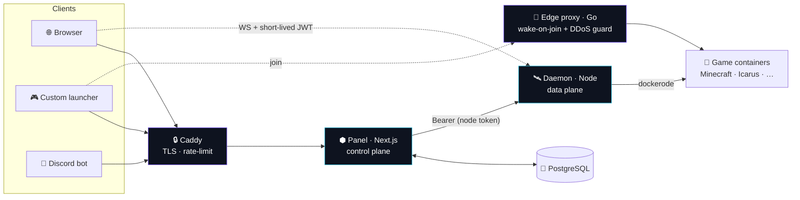

<div align="center">


# Aether

### Game servers, summoned in seconds.

**Premium, self-hostable multi-game hosting** — Minecraft, Icarus & more — with a
stunning glass/bento control panel, wake-on-join sleeping, one-click mods,
layered DDoS protection, and a clean API built for your **own launcher**.

<br/>

[](https://github.com/Micka420-collab/Aether_Panel/actions/workflows/ci.yml)
[](LICENSE)


<br/>


<br/>

[**Features**](#-features) · [**Architecture**](#-architecture) · [**Quick start**](#-quick-start) · [**Launcher API**](#-connect-your-launcher) · [**DDoS protection**](#-ddos-protection-layered) · [**Security**](#-security)

</div>

---

## Why Aether?

Built to out-class Pterodactyl, Aternos, Shockbyte & GPORTAL on **three axes at once**:

| 🎛️ UX | 🧩 Breadth | 🛡️ Trust |
|-------|-----------|----------|
| One-click deploy, live console & telemetry, wake-on-join sleeping, a glass/bento dashboard that doesn't look like 2014. | A generic *template (egg)* engine — Minecraft & Icarus today, any game as **data, not code**. | Live TPS/RAM/CPU, hardened container isolation, layered DDoS protection, fair sleeping (no daily caps). |

---

## ✨ Features

| | |
|---|---|
| 🟩 **Multi-game** | Minecraft (Java + Bedrock: Paper, Purpur, Fabric, Forge, NeoForge, Vanilla, modpacks) · Icarus · Valheim · Palworld · Rust |
| 🖥️ **Live console** | Real-time xterm-style console over WebSocket, command input, power controls |
| 📊 **Telemetry** | CPU / RAM / disk / network / players, live, in a bento dashboard |
| 🌙 **Wake-on-join** | Servers sleep when empty and wake on the first connection — plus a no-login shareable wake link |
| 📦 **One-click content** | Search & install mods/plugins/modpacks from **Modrinth** *and* **CurseForge** |
| 📁 **Files + SFTP** | In-browser editor & a jailed SFTP server (your account password) |
| 💾 **Backups** | On-demand & scheduled, world-flushed, restore in one click |
| 🌐 **Free subdomains** | Claim `you.example.com` — auto **A + SRV** records (Cloudflare) |
| ⏰ **Scheduled tasks** | Cron restarts / commands / backups via an in-process scheduler |
| 👥 **Sub-users** | Granular, scoped team access to a server |
| 💳 **Credit billing** | Per-GB-hour metering, never charged while stopped |
| 🔌 **Launcher API** | Device-code auth + versioned REST/WS API for your custom launcher |
| 🤖 **Discord bot** | `/status` `/start` `/stop` `/console` from Discord |
| 🚨 **Monitoring** | Node-health & crash detection, auto-restart, Discord-webhook alerts |
| 🛡️ **DDoS protection** | Layered: panel rate-limit + Minecraft-aware edge guard + nftables |
| 🔐 **Account security** | TOTP 2FA, scoped hashed API keys, brute-force lockout, audit log |

---

## 🏗️ Architecture

A stateless **control plane** (panel) + a per-node **data plane** (daemon) — the
proven Panel ↔ Wings split, rebuilt as a modern TypeScript/Go monorepo.



- **`packages/shared`** — dependency-free types, permission scopes, and the **game-template engine**.
- **`apps/panel`** — Next.js (App Router): marketing site + dashboard + REST + `/api/v1` launcher API + cron scheduler + monitor. Prisma/PostgreSQL.
- **`apps/daemon`** — controls Docker via `dockerode`: lifecycle, console/stats WebSocket, RCON, jailed file manager, SFTP, tar.gz backups.
- **`apps/edge-proxy`** — Go wake-on-join proxy with a Minecraft-aware anti-DDoS guard.

---

## 🚀 Quick start

**Ubuntu + Docker — one command:**

```bash
git clone https://github.com/Micka420-collab/Aether_Panel.git aether && cd aether
sudo bash deploy/install.sh           # add APPLY_FIREWALL=1 to also harden the host
```

The installer provisions Docker, generates strong secrets, builds the images and
brings up **panel + daemon + Postgres + Caddy + edge-proxy**. Open the printed URL
and register — the **first account becomes the admin**.

> 💡 Set `APP_DOMAIN=panel.example.com` first for automatic HTTPS.

<details>
<summary><b>Local development</b></summary>

```bash
npm install
npm run build:shared
cp .env.example .env                            # then edit the secrets
cp apps/panel/.env.example apps/panel/.env
# start Postgres, then:
npm run db:push  --workspace @aether/panel
npm run db:seed  --workspace @aether/panel
npm run dev                                     # panel :3000 + daemon :8080
npm test                                        # vitest (template engine + path jail)
```

The daemon needs a reachable Docker engine (`/var/run/docker.sock`).
</details>

---

## 🎮 Adding a game

A game is **just data**. Write one `GameTemplate` object in
`packages/shared/src/templates/` and register it — it declares the Docker
image(s), startup/stop behaviour, ports, env variables (auto-rendered as a
settings form), install script and capability flags (`rcon`, `wine`, `steamcmd`,
`mods`, …). No daemon or panel changes needed.

> See `minecraft.ts` (RCON) and `icarus.ts` (SteamCMD-under-Wine) for examples.

---

## 🔌 Connect your launcher

`/api/v1` exposes a desktop-friendly **device-code** flow + live connection info:

```ts
// 1 · authenticate (no embedded secrets)
const { user_code, device_code } = await api.post("/api/v1/auth/device/start");
showToUser(user_code);                          // "AB12-CD34" → user approves at /link
const { access_token } = await api.poll("/api/v1/auth/device/poll", { device_code });

// 2 · list the user's servers, get join info
const { servers } = await api.get("/api/v1/client", { bearer: access_token });
const conn = await api.get(`/api/v1/client/servers/${servers[0].id}/connection`);

// 3 · launch straight into the server
minecraft.launch({ server: conn.host, port: conn.port });
```

A runnable, zero-dependency reference client lives in
[`examples/launcher`](examples/launcher) · full guide at `/docs/launcher` in-app.

---

## 🛡️ DDoS protection (layered)

Defence-in-depth — no single layer is relied upon:

| Layer | Where | What it does |
|-------|-------|--------------|
| **L7 — panel/API** | `apps/panel/src/middleware.ts` | Per-IP rate limiting (strict on auth), `429` + `Retry-After`, security headers |
| **Minecraft-aware** | `apps/edge-proxy` guard | Per-IP conn caps + rate, ping-flood throttle, slow-loris timeout, junk-flood auto temp-ban, blocklist, PROXY-protocol real-IP |
| **L4 — host** | `deploy/firewall.sh` (nftables) | Drop conntrack-INVALID, per-source SYN-flood limiting, UDP anti-amplification, ICMP/SSH limits, **Attack Mode** |
| **Edge / TLS** | Caddy | Auto-HTTPS, HSTS, security headers, HTTP/2-3 |
| **Upstream (optional)** | provider | Front game traffic with a scrubber (Cloudflare Spectrum / TCPShield); PROXY protocol preserves real client IPs |

```bash
sudo SSH_PORT=22 bash deploy/firewall.sh apply   # or 'attack' under active attack
```

---

## 🔐 Security

Hardened by design and **audited adversarially** — see
[`docs/SECURITY-AUDIT.md`](docs/SECURITY-AUDIT.md) and [`SECURITY.md`](SECURITY.md).

- bcrypt + **TOTP 2FA** (AES-256-GCM-encrypted secrets, HMAC'd single-use recovery codes)
- Secrets **fail closed** in production · constant-time token comparisons
- Scoped, hashed **API keys** · short-lived HMAC WebSocket tokens
- Path-jailed (symlink-safe) file manager & SFTP · per-server permission scopes
- Per-account **brute-force lockout** · trusted client-IP (anti-spoofing)
- Per-container CPU/RAM/PID limits + capability drop · RCON bound to loopback

---

## 🧰 Tech stack

| Area | Tech |
|------|------|
| **Panel** | Next.js (App Router), React, TypeScript, Tailwind CSS, Framer Motion, Prisma, PostgreSQL |
| **Daemon** | Node.js, Express, `dockerode`, `ws`, RCON, `ssh2` (SFTP) |
| **Edge proxy** | Go (Minecraft protocol, wake-on-join, DDoS guard) |
| **Auth** | DB sessions, `jose` (JWT/HMAC), `otplib` (TOTP), `bcryptjs` |
| **Infra** | Docker Compose, Caddy (auto-TLS), nftables, GitHub Actions CI, Vitest |

---

## 📂 Repo layout

```
packages/shared      types, scopes, game-template engine  (+ vitest)
apps/panel           Next.js panel — UI + REST + launcher API + scheduler + monitor
apps/daemon          Docker control daemon + SFTP server  (+ vitest)
apps/edge-proxy      Go wake-on-join proxy + anti-DDoS guard
apps/discord-bot     Discord slash-command control bot
examples/launcher    zero-dep reference launcher client
deploy/              install.sh · Caddyfile · firewall.sh · systemd unit
docker-compose.yml   one-host stack
.github/workflows    CI: build · typecheck · tests · go build
```

---

## 🗺️ Roadmap

Tracked in [`docs/SECURITY-AUDIT.md`](docs/SECURITY-AUDIT.md) and the issues:
Stripe billing · Microsoft/Discord OAuth login · Pterodactyl egg import ·
multi-node scheduling · Redis-backed rate-limit · Next.js major upgrade.

---

<div align="center">

**MIT licensed** · Built with ⟁ for self-hosters.

</div>
